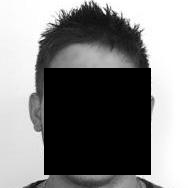
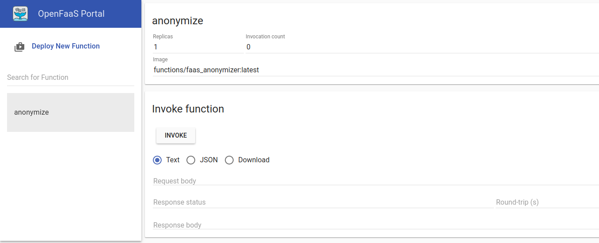
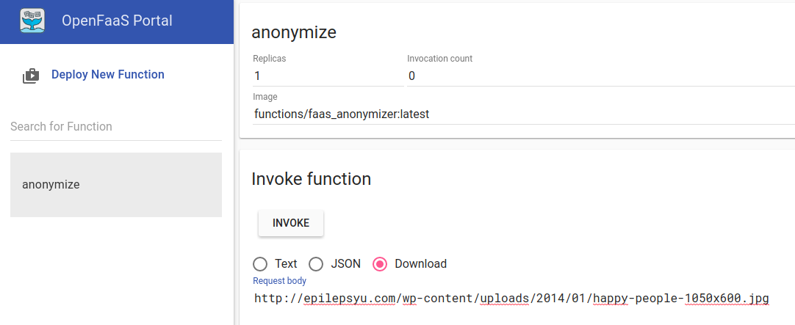
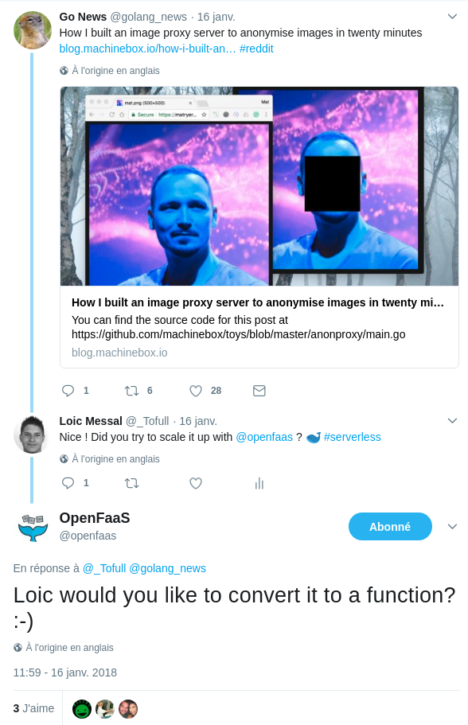

# OpenFaaS function : faceBox from MachineBox [](https://GitHub.com/Tofull/faas_facebox/stargazers/)

[](https://twitter.com/_Tofull) [](https://github.com/tofull)


This repository provides an OpenFaaS function to remove faces on pictures thanks to online machine learning service called MachineBox.


Input                      |  Output
:-------------------------:|:-------------------------:
  |  


## Technical instructions
### Installation
1. You need the [OpenFaas CLI](https://github.com/openfaas/faas-cli) to build and deploy the function. So, first of all, you need to download it. 
    
    `curl -sL https://cli.openfaas.com | sudo sh`

2. This function is based on a MachineBox service called FaceBox. You can host your own facebox server with `docker run -p 8081:8080 -e "MB_KEY=${MB_KEY}" machinebox/facebox`. No worry, I already added this service for you in the OpenFaaS stack :thumbsup: .

    By the way, you still have to get your own MachineBox key. Just [sign in on MachineBox](https://machinebox.io/login?return_url=%2Faccount).

3. Set your MachineBox key as environment variable : 

    `MB_KEY="ThIsIsThEKeYiGeTfRoMhTtPs://mAcHiNeBoX.Io/aCcOuNt"`

4. Init your docker swarm cluster : 

    `docker swarm init`

5. Deploy the OpenFaaS stack (embedded machinebox service on port 8081) : 

    `MB_KEY=${MB_KEY} docker stack deploy func --compose-file docker-compose.yml`

6. Build the anonymizer function : 
    
    `./build_all.sh`

7. Deploy the function on OpenFaaS : 
    
    `faas-cli deploy -f func_facebox.yml`


### Anonymize your pictures !

I arbitrary chose this picture for the test *(first Google Images item for keyword people)*: 
<p align="center">
    
</p>

#### Via the OpenFaaS UI :
1. On you browser (*http://localhost:8080*), you should get something like :


2. Select the Download option and paste your image URL :


3. Press **Invoke** button!
Your anonymized picture is downloading.

4. Open your anonymized picture with your favorite image viewer ! That rocks ! 
<p align="center">
    
</p>


#### Via the OpenFaaS API : 
Because OpenFaaS provides a REST API, you can invoke this function programmatically :

```bash
URL="http://epilepsyu.com/wp-content/uploads/2014/01/happy-people-1050x600.jpg"
curl http://localhost:8080/function/anonymize -d "${URL}" > example_anonymized_people_curl.jpg
```


### Cleanup :

```bash
docker stack rm func
docker swarm leave --force
```

### Options : 
If you want to use another FaceBox server url, simply change the *facebox* environment variable in file *func_facebox.yml* to fit with yours.
```yaml
functions:
  anonymize:
    lang: Dockerfile
    handler: ./faas_anonymizer
    image: functions/faas_anonymizer:latest
    environment:
      facebox: https://myFaceBoxServer
```

## Motivation

This challenge was given on [Twitter](https://twitter.com/openfaas/status/953356175919271936?ref_src=twsrc) : 
<p align="center">
    <a href="https://twitter.com/openfaas/status/953356175919271936?ref_src=twsrc">  </a>
</p>

The function source code is strongly inspired from [this MachineBox blog post](https://blog.machinebox.io/how-i-built-an-image-proxy-server-to-anonymise-images-in-twenty-minutes-e550466ea09e).

## Details
For more details about [Machine Box](https://machinebox.io/).

For more details about [OpenFaaS](https://www.openfaas.com/).

Give this repository a star (because it's my first golang function hack) : [](https://GitHub.com/Tofull/faas_facebox/stargazers/)

Follow my activities : [](https://twitter.com/_Tofull) [](https://github.com/tofull) [](https://tofull.github.io/) 
